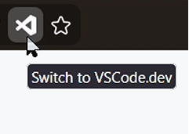

#  Toggle Github.Dev

This simple Firefox addon adds a URL button to quickly toggle `vscode.dev` view of the repository (formerly `github.dev`). It shows "Switch to VSCode.dev" button when you're on any "github.com" page, and vice verse. 

 
